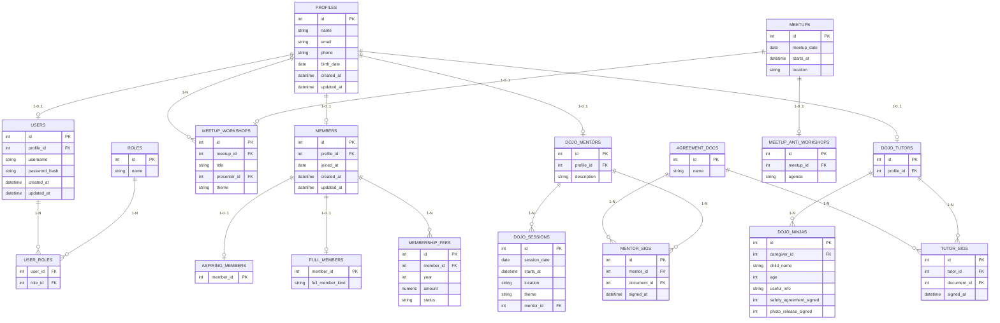

# Plan: Schema bazei de date SQLite pentru aplicația AI3

## 1. Contexte și constrângeri

- **Tehnologie**: SQLite, schema normalizată (3NF/BCNF), denumiri în engleză (standard industrie).
- **Surse**: cerințele tale, diagramele atașate, [Statutul AI3](https://ai3.ro/Statut_AI3.pdf) (Art. 6–13, 15–20).
- **Modul actual**: doar **user**, **profil**, **membri**, **meetups**, **dojo**. Adunarea Generală și Festival pot fi incluse în diagramă ca extensii ulterioare.

---

## 2. Principii de modelare

- **Profil** = entitate centrală pentru persoane (membri, mentori, tutori/caregivers, ninjas, prezentatori, simpatizanți, invitați). Nu toate persoanele au cont în platformă → **User** opțional 1:1 cu Profile.
- **Membri**: **Class Table Inheritance (CTI)** — tipul de membership ca sum type, fără legături către tabele externe de lookup. Tabel de bază **members**; subclase: **aspiring_members** (Aspiring), **full_members** (Full FullMember) cu câmp **full_member_kind** = `'founder'` | `'honorary'` | `'regular'` (echivalent `data FullMember = Founder | Honorary | Regular`; `data Member = Aspiring | Full FullMember`). Fiecare membru apare în exact una din subclase. Drept de vot = prezență în **full_members** (pentru AG). Cotizația în **membership_fees** doar pentru `full_member_kind = 'regular'`. Fără istoric în timp (fără `left_at`).
- **Meetups**: un meetup = o întâlnire cu **dată, oră și locație** (o singură sursă: doar în `meetups`); fie are un atelier, fie un anti-atelier (alternanță săptămânală). Locația și ora nu se redau în tabelele de atelier/anti-atelier.
- **Dojo**: scopul este **anunțarea** sesiunilor (dată, oră, locație, tematică, **mentor responsabil** care ține sesiunea). Nu se face tracking de prezență. **Tutore** = caregiver pentru un ninja (profilul care are grija de copil); ninja este legat de un tutore. Acordurile: documente cu **nume unic** (pentru link și acțiune); acordul dat = legătura mentor/tutore ↔ document cu **timestamp de semnare** (mentorii = instruit despre lucrul cu copiii; tutorii = instruit despre ce să le spună copiilor + acord privacy).
- **RBAC**: roluri și legături user–rol pentru acces per modul (username/parolă doar la User).

---

## 3. Schema tabelelor (SQLite)

### 3.1 Utilizatori și profil

| Tabel          | Descriere                                                                                                                                                                                               |
| -------------- | ------------------------------------------------------------------------------------------------------------------------------------------------------------------------------------------------------- |
| **profiles**   | Persoană: `id` PK, `name` TEXT NOT NULL, `email` TEXT, `phone` TEXT, `birth_date` DATE, `created_at`, `updated_at`. Email/telefon pot fi NULL pentru persoane doar legate (ex. ninja doar prin tutore). |
| **users**      | Cont platformă: `id` PK, `profile_id` INTEGER UNIQUE NOT NULL FK→profiles, `username` TEXT UNIQUE NOT NULL, `password_hash` TEXT NOT NULL, `created_at`, `updated_at`. Un profil are cel mult un user.  |
| **roles**      | Roluri RBAC: `id` PK, `name` TEXT UNIQUE NOT NULL (ex. admin, member, mentor).                                                                                                                          |
| **user_roles** | Legătură M:N: `user_id` FK→users, `role_id` FK→roles, PK (user_id, role_id).                                                                                                                            |

### 3.2 Membri (Class Table Inheritance)

Echivalent tipuri de date sum: `data FullMember = Founder | Honorary | Regular`; `data Member = Aspiring | Full FullMember`. Fără tabele externe de lookup; subtipul este dat de prezența în una din tabelele-subclasă.

| Tabel                | Descriere                                                                                                                                                                                                                                                                                                       |
| -------------------- | --------------------------------------------------------------------------------------------------------------------------------------------------------------------------------------------------------------------------------------------------------------------------------------------------------------- |
| **members**          | Tabel de bază: `id` PK, `profile_id` INTEGER UNIQUE NOT NULL FK→profiles, `joined_at` DATE NOT NULL, `created_at`, `updated_at`. Fără `left_at`. Fiecare rând este fie Aspiring fie Full (constraint: exact una din subclase).                                                                                  |
| **aspiring_members** | Subclasă (Aspiring): `member_id` PK FK→members (1:1). Prezența rândului = membru aspirant (fără drept de vot).                                                                                                                                                                                                  |
| **full_members**     | Subclasă (Full FullMember): `member_id` PK FK→members (1:1), `full_member_kind` TEXT NOT NULL CHECK(full_member_kind IN ('founder','honorary','regular')). Prezența rândului = membru cu drept de vot; `full_member_kind` = variantă (Founder / Honorary / Regular). Cotizația nu se solicită founder/honorary. |
| **membership_fees**  | Cotizație anuală: `id` PK, `member_id` FK→members, `year` INTEGER NOT NULL, `amount` NUMERIC, `status` TEXT NOT NULL. UNIQUE(member_id, year). Doar pentru membri care au rând în **full_members** cu `full_member_kind = 'regular'` (trigger sau aplicație).                                                   |

**Constraint**: fiecare `members.id` apare în exact una din `aspiring_members` sau `full_members` (trigger sau aplicație). Drept de vot în AG: membru are rând în **full_members**.

### 3.3 Meetups (întâlniri săptămânale)

**Locația și ora** sunt doar în `meetups` (fără duplicare în atelier/anti-atelier).

| Tabel                     | Descriere                                                                                                                                                                                                                                                                                                         |
| ------------------------- | ----------------------------------------------------------------------------------------------------------------------------------------------------------------------------------------------------------------------------------------------------------------------------------------------------------------- |
| **meetups**               | Întâlnire: `id` PK, `date` DATE NOT NULL, `starts_at` TIME/DATETIME NOT NULL, `location` TEXT NOT NULL, `created_at`, `updated_at`. Sursa unică pentru dată, oră și locație.                                                                                                                                      |
| **meetup_workshops**      | Atelier: `id` PK, `meetup_id` INTEGER UNIQUE NOT NULL FK→meetups (1:1), `title` TEXT NOT NULL, `presenter_id` INTEGER NOT NULL FK→profiles, `theme` TEXT NOT NULL CHECK(theme IN ('demo_your_stack','fup_nights','meet_the_business')), `created_at`, `updated_at`. Fără location/starts_at — se iau din meetups. |
| **meetup_anti_workshops** | Anti-atelier: `id` PK, `meetup_id` INTEGER UNIQUE NOT NULL FK→meetups (1:1), `agenda` TEXT, `created_at`, `updated_at`. Fără location/starts_at — se iau din meetups.                                                                                                                                             |

Tematică atelier = enum prin CHECK (suficient, fără tabel `workshop_themes`). Fiecare meetup are fie un rând în `meetup_workshops`, fie unul în `meetup_anti_workshops` (constraint aplicativ).

### 3.4 CoderDojo

Scop: **anunțarea** sesiunilor (tematică + mentor responsabil care ține sesiunea). Fără tracking de prezență. **Tutore** = caregiver pentru ninja (profilul care are grija de copil).

| Tabel                           | Descriere                                                                                                                                                                                                                                                                                                                                                                                                                            |
| ------------------------------- | ------------------------------------------------------------------------------------------------------------------------------------------------------------------------------------------------------------------------------------------------------------------------------------------------------------------------------------------------------------------------------------------------------------------------------------ |
| **dojo_sessions**               | Sesiune anunțată: `id` PK, `session_date` DATE NOT NULL, `starts_at` DATETIME, `location` TEXT NOT NULL, `theme` TEXT, `mentor_id` INTEGER NOT NULL FK→dojo_mentors (mentorul care **ține** sesiunea), `created_at`, `updated_at`.                                                                                                                                                                                                   |
| **dojo_mentors**                | Mentor: `id` PK, `profile_id` INTEGER NOT NULL FK→profiles, `description` TEXT, `created_at`, `updated_at`.                                                                                                                                                                                                                                                                                                                          |
| **dojo_tutors**                 | Tutore (caregiver) pentru ninja: `id` PK, `profile_id` INTEGER NOT NULL FK→profiles, `created_at`, `updated_at`. Un tutore este persoana care are grija de copil (ninja).                                                                                                                                                                                                                                                            |
| **dojo_ninjas**                 | Copil (ninja): `id` PK, `caregiver_id` INTEGER NOT NULL FK→dojo_tutors (tutorele/caregiver-ul), `child_name` TEXT NOT NULL, `age` INTEGER, `useful_info` TEXT (alergii, abordare învățare etc.), `safety_agreement_signed` INTEGER NOT NULL DEFAULT 0, `photo_release_signed` INTEGER NOT NULL DEFAULT 0, `created_at`, `updated_at`. Date contact guardian pot fi pe profilul tutorelui (profile) sau redondate aici dacă e nevoie. |
| **agreement_documents**         | Documente de acord cu **nume unic** (pentru generare link): `id` PK, `name` TEXT UNIQUE NOT NULL (ex. "Mentor training - working with children", "Tutor privacy and rules").                                                                                                                                                                                                                                                         |
| **mentor_agreement_signatures** | Acord dat = legătura mentor ↔ document cu timestamp: `id` PK, `mentor_id` FK→dojo_mentors, `document_id` FK→agreement_documents, `signed_at` DATETIME NOT NULL, `created_at`. UNIQUE(mentor_id, document_id) dacă un mentor semnează o singură dată per document.                                                                                                                                                                    |
| **tutor_agreement_signatures**  | Acord dat = legătura tutore (caregiver) ↔ document cu timestamp: `id` PK, `tutor_id` FK→dojo_tutors, `document_id` FK→agreement_documents, `signed_at` DATETIME NOT NULL, `created_at`. UNIQUE(tutor_id, document_id).                                                                                                                                                                                                               |

### 3.5 Adunare Generală (extensie / fază ulterioară)

Drept de vot: doar membrii care au rând în **full_members** (aspiranții nu votează).

| Tabel                          | Descriere                                                                                                                                                                                                                            |
| ------------------------------ | ------------------------------------------------------------------------------------------------------------------------------------------------------------------------------------------------------------------------------------ |
| **general_assemblies**         | `id` PK, `year` INTEGER NOT NULL, `announced_at` DATE, `held_at` DATE, `location` TEXT, `min_quorum` INTEGER, `activity_report_document_id` (referință document), `minutes_document_id` (proces verbal), `created_at`, `updated_at`. |
| **general_assembly_attendees** | `assembly_id` FK→general_assemblies, `member_id` FK→members, `attended` INTEGER, PK (assembly_id, member_id). La vot: filtrare după existența în **full_members** (JOIN full_members ON member_id).                                  |

---

## 4. Diagramă Entity-Relationship

Diagrama ER arată tabelele, câmpurile și cardinalitățile. Simboluri: `||--o|` = 1 la 0..1, `||--o{` = 1 la N, `}o--o{` = N la M. Dacă diagrama Mermaid nu se renderează în preview, folosiți **tabelul de câmpuri și cardinalități** de mai jos.

**Tabel de câmpuri și cardinalități** (referință completă dacă diagrama Mermaid nu se afișează):

| Tabel                           | Câmpuri                                                                                             | Cardinalitate relații                      |
| ------------------------------- | --------------------------------------------------------------------------------------------------- | ------------------------------------------ |
| **profiles**                    | id PK, name, email, phone, birth_date, created_at, updated_at                                       | —                                          |
| **users**                       | id PK, profile_id FK UNIQUE, username UNIQUE, password_hash, created_at, updated_at                 | profile 1 → 0..1 user                      |
| **roles**                       | id PK, name UNIQUE                                                                                  | —                                          |
| **user_roles**                  | user_id FK, role_id FK — PK compus                                                                  | user 1→N, role 1→N                         |
| **members**                     | id PK, profile_id FK UNIQUE, joined_at, created_at, updated_at (CTI base)                           | profile 1→0..1                             |
| **aspiring_members**            | member_id PK FK→members (1:1) — subclasă Aspiring                                                   | members 1→0..1                             |
| **full_members**                | member_id PK FK→members (1:1), full_member_kind CHECK(founder,honorary,regular) — subclasă Full     | members 1→0..1                             |
| **membership_fees**             | id PK, member_id FK, year, amount, status — UNIQUE(member_id, year); doar full_member_kind=regular  | members 1→N (doar regular)                 |
| **meetups**                     | id PK, date, starts_at, location (sursa unică oră/locație)                                          | —                                          |
| **meetup_workshops**            | id PK, meetup_id FK UNIQUE, title, presenter_id FK, theme (enum CHECK), created_at, updated_at      | meetup 1→0..1; profile 1→N                 |
| **meetup_anti_workshops**       | id PK, meetup_id FK UNIQUE, agenda, created_at, updated_at                                          | meetup 1→0..1                              |
| **dojo_sessions**               | id PK, session_date, starts_at, location, theme, mentor_id FK                                       | dojo_mentors 1→N                           |
| **dojo_mentors**                | id PK, profile_id FK, description                                                                   | profile 1→0..1; 1→N sesiuni; 1→N semnături |
| **dojo_tutors**                 | id PK, profile_id FK                                                                                | profile 1→0..1; 1→N ninjas; 1→N semnături  |
| **dojo_ninjas**                 | id PK, caregiver_id FK, child_name, age, useful_info, safety_agreement_signed, photo_release_signed | dojo_tutors 1→N                            |
| **agreement_documents**         | id PK, name UNIQUE                                                                                  | 1→N mentor_sigs, 1→N tutor_sigs            |
| **mentor_agreement_signatures** | id PK, mentor_id FK, document_id FK, signed_at                                                      | dojo_mentors 1→N; agreement_documents 1→N  |
| **tutor_agreement_signatures**  | id PK, tutor_id FK, document_id FK, signed_at                                                       | dojo_tutors 1→N; agreement_documents 1→N   |

**Cardinalități rezumate:**

- **Profile** 1 —— 0..1 **User** (un profil are cel mult un cont).
- **Profile** 1 —— 0..1 **Member**. **Member** (CTI): fie **Aspiring** (rând în aspiring_members), fie **Full** (rând în full_members cu full_member_kind = founder | honorary | regular). **Member** 1 —— N **MembershipFees** (doar full_member_kind = regular). Drept de vot în AG = prezență în **full_members**.
- **Profile** 1 —— 0..N **MeetupWorkshop** (prezentator).
- **Profile** 1 —— 0..1 **DojoMentor**, 0..1 **DojoTutor** (tutore = caregiver).
- **Meetup** 1 —— 0..1 **MeetupWorkshop** și 0..1 **MeetupAntiWorkshop** (fiecare meetup este fie atelier, fie anti-atelier).
- **DojoSession** N —— 1 **DojoMentor** (mentorul care ține sesiunea); fără tracking prezență.
- **DojoTutor** 1 —— N **DojoNinja** (tutore = caregiver pentru ninja).
- **AgreementDocument** 1 —— N **MentorAgreementSignature** și **TutorAgreementSignature** (acord = semnătură pe document cu timestamp).

---

## 5. Constrângeri și implementare SQLite

- **Foreign keys**: `PRAGMA foreign_keys = ON;` și definirea FK la CREATE TABLE.
- **UNIQUE**: `profile_id` în users și members; `meetup_id` în meetup_workshops și meetup_anti_workshops.
- **CHECK**: `meetup_workshops.theme IN ('demo_your_stack','fup_nights','meet_the_business')`; `full_members.full_member_kind IN ('founder','honorary','regular')`. **members (CTI)**: fiecare membru în exact una din aspiring_members sau full_members (trigger sau aplicație). **membership_fees**: doar pentru membri cu rând în full_members și full_member_kind = 'regular' (trigger sau aplicație).
- **Indexuri**: pe `users.username`, `profiles.email`, `members.profile_id`, `meetups.date`, `dojo_sessions.session_date`, FK-uri folosite în JOIN-uri.
- **Parole**: doar hash (bcrypt/argon2) în `users.password_hash`, niciodată parolă în clar.

---
